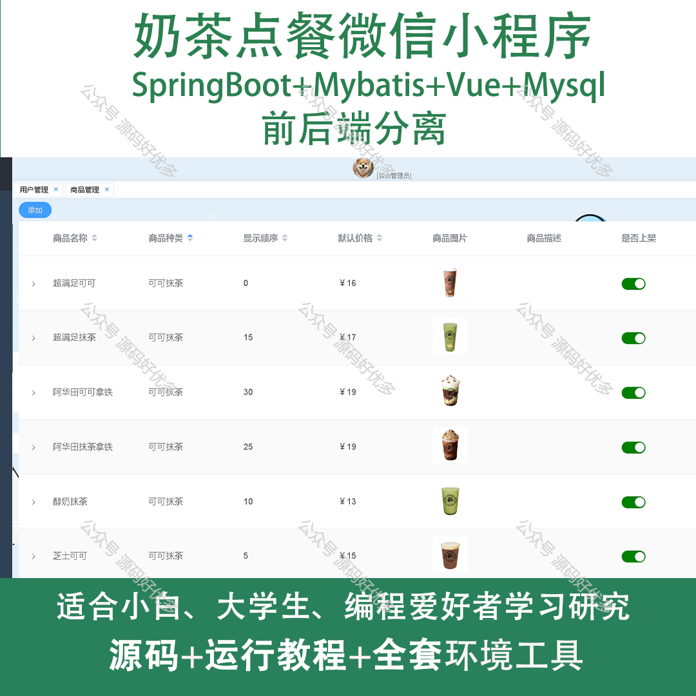
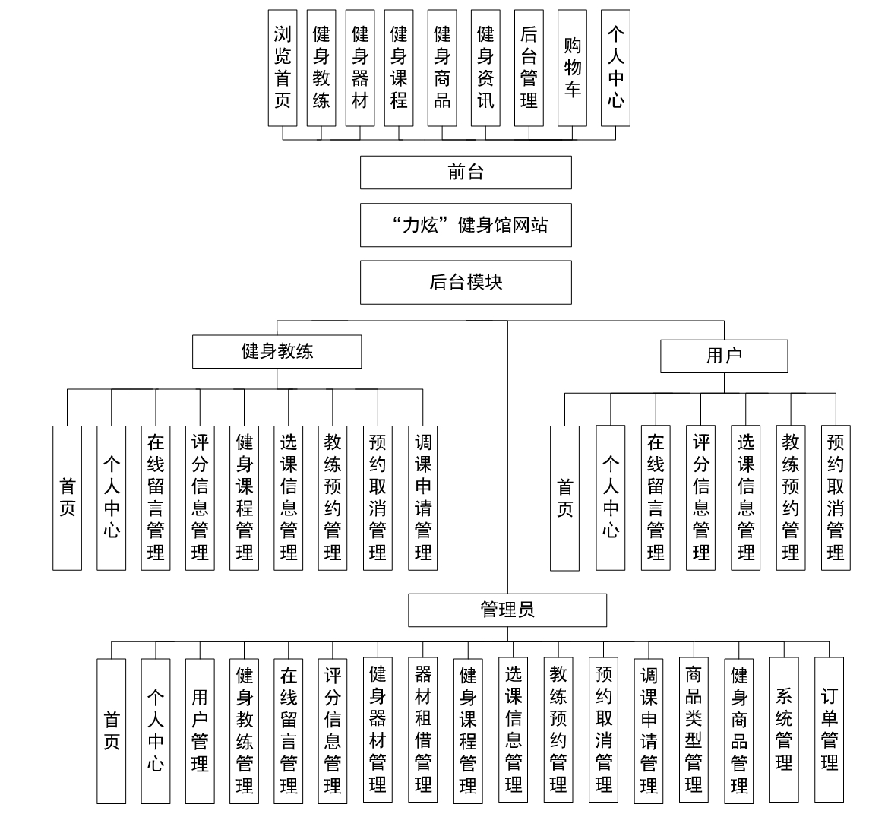
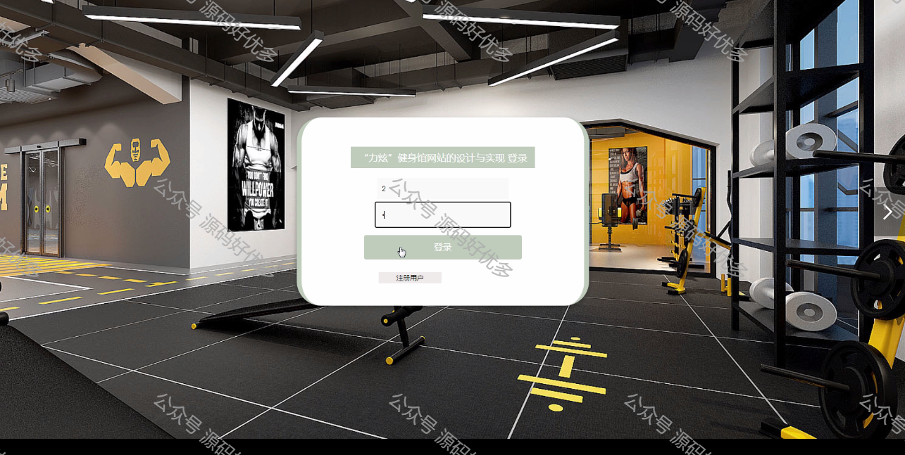
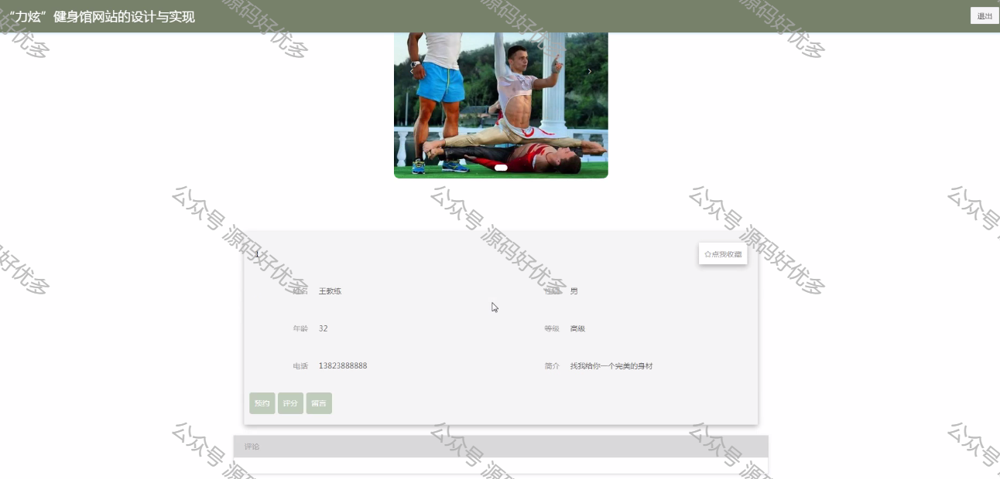
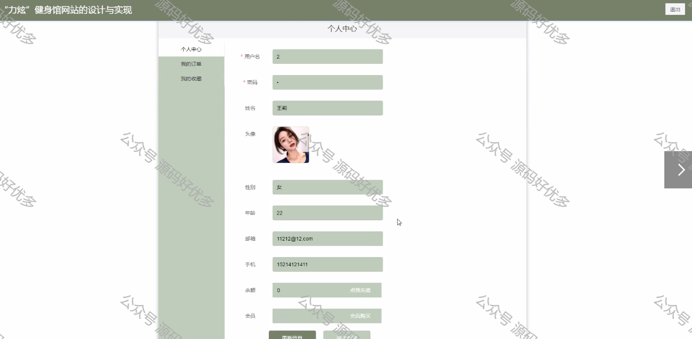
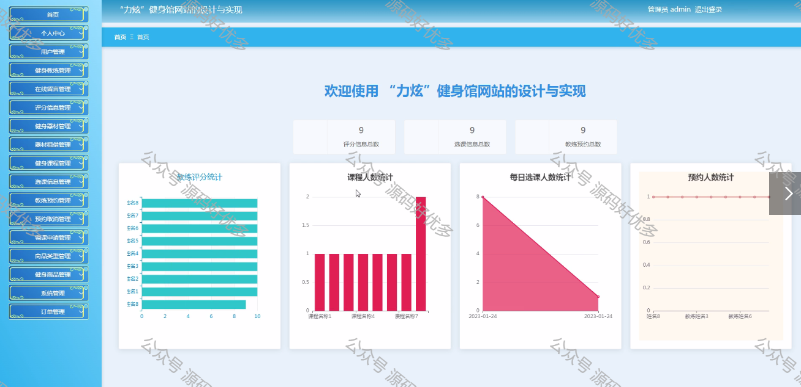
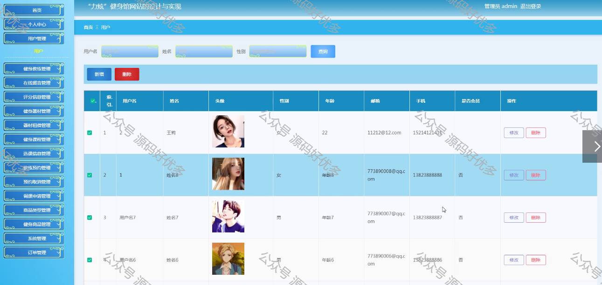
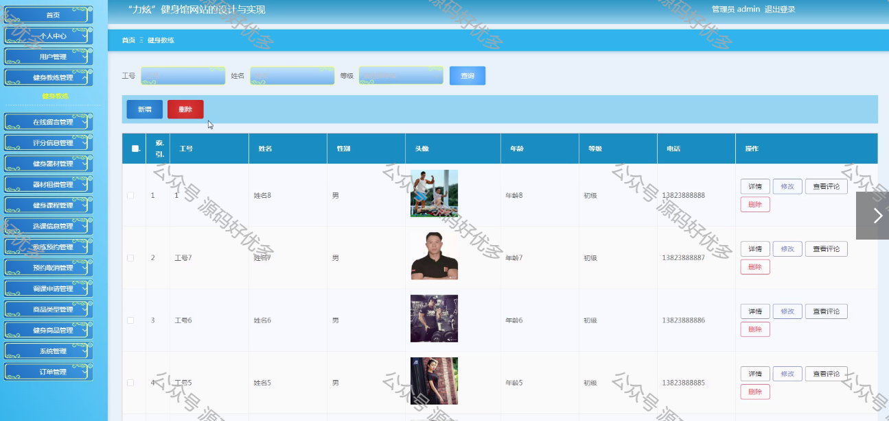
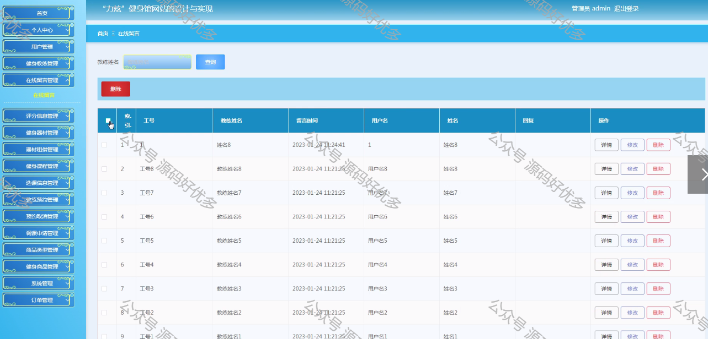

 
## 查看主页获取源码

> **作者介绍**： **✌**全网粉丝10W+本平台特邀作者、博客专家、CSDN新星计划导师、java领域优质创作者,博客之星、掘金/华为云/阿里云/InfoQ等平台优质作者、专注于项目实战 **✌**

  

### 一、作品包含

源码+数据库+全套环境和工具资源+部署教程

### 二、项目技术

前端技术：Html、Css、Js、Vue、Element-ui

数据库：MySQL

后端技术：Java、Spring Boot、MyBatis

  

### 三、运行环境

开发工具：IDEA，微信开发者工具

数据库：MySQL8.0

数据库管理工具：Navicat10以上版本

环境配置软件： JDK1.8+Maven3.6.3

前端Nodejs：12

### 四、项目介绍
项目编号：mpweixinA103

奶茶点餐微信小程序，紧跟数字化餐饮潮流，为喜爱奶茶的消费者提供了一个便捷的点餐体验。通过小程序，用户可以轻松浏览奶茶菜单，个性化定制饮品，一键下单，享受快速便捷的服务。我们的目标是让每一位奶茶爱好者都能随时随地，通过简单的操作，品尝到心爱的饮品，享受美好的休闲时光。

奶茶点餐小程序功能：客户端登录、个人中心、点餐、选规格、去结算、取餐、我的信息、管理员登录、管理员首页、用户管理、商品管理、商品编辑、商品种类、订单管理、订单处理、等等。

### 五、运行截图

  
